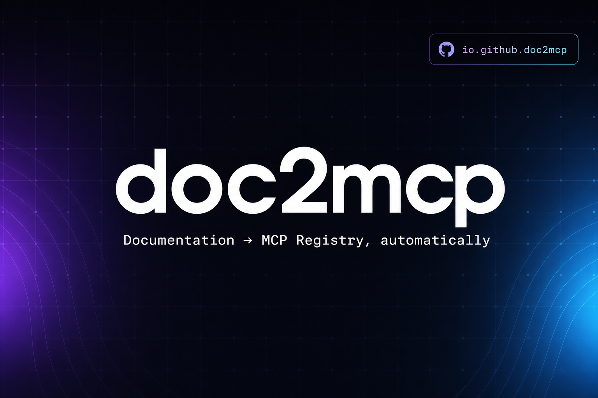

<div align="center">

# doc2mcp

### Documentation infrastructure for AI agents

**Paste any docs URL → get a hosted, Cursor-ready MCP server in under 60 seconds.**

No install. No local clone. No API keys to hand over.



[**Live**](https://doc2mcp.site) · [Docs](https://doc2mcp.site/docs) · [Pricing](https://doc2mcp.site/pricing) · [Comparison](https://doc2mcp.site/comparison)

[](https://nextjs.org)
[](https://modelcontextprotocol.io)
[](https://registry.modelcontextprotocol.io/?search=doc2mcp)
[](#license)

</div>

---

## Why doc2mcp

LLMs hallucinate APIs because docs are written for humans, not agents. doc2mcp
turns documentation into the **runtime your AI editor actually calls** — a
hosted Model Context Protocol server with typed tools, semantic retrieval, and
live sync. Not a docs website. Not a copy-paste snippet. Real infrastructure.

```
 Documentation → Crawling → Knowledge processing → Retrieval → MCP generation → AI agents
```

## How it works

1. Paste a docs URL — LangChain, Stripe, your own — in the chat with the
   **doc2mcp** toggle on.
2. The pipeline crawls the site (Mintlify, Docusaurus, OpenAPI JSON/YAML,
   GitHub repos, GitBook, plain HTML), preserving code blocks and chunking by
   heading.
3. You get a remote MCP URL + Bearer token. Paste it into Cursor's `mcp.json`
   and reload.
4. Every generated MCP is **auto-published to the official MCP Registry** under
   `io.github.doc2mcp/<slug>` and listed in the marketplace.

```json
{
  "mcpServers": {
    "stripe": {
      "url": "https://doc2mcp.site/api/mcp/<projectId>/mcp",
      "headers": {
        "Authorization": "Bearer <project-token>"
      }
    }
  }
}
```

## CLI

[](https://www.npmjs.com/package/doc2mcp)
[](https://www.npmjs.com/package/doc2mcp)

Install the terminal client and run the same conversion pipeline from your shell:

```bash
npm install -g doc2mcp   # global install puts `doc2mcp` on your PATH
doc2mcp login            # browser-based device auth
doc2mcp https://docs.example.com
```

> Use `-g`. A local `npm i doc2mcp` won't expose the `doc2mcp` command — use `npx doc2mcp <url>` instead.

The CLI uses browser-based device auth, shares your web account limits, auto-lists
ready MCPs in the marketplace, and can write configs to Cursor, VS Code, Claude
Desktop, and Windsurf.

- 📦 npm: https://www.npmjs.com/package/doc2mcp
- 📖 Full command reference: [`cli/README.md`](./cli/README.md) · [docs/cli](https://doc2mcp.site/docs/cli)

## MCP tools

| Tool | What it does |
|------|--------------|
| `list_documentation_pages` | Every crawled page (title, url, id) |
| `get_documentation_page` | Full markdown of one page |
| `search_documentation` | Heading-aware section search (BM25-ish scoring) |
| `get_documentation_overview` | Summary + `llms.txt` index |
| `read_full_documentation` | All pages combined as one big markdown |
| `ask_documentation` | Natural-language Q&A using ASI1 with citations |

## Supported source formats

- **Mintlify** docs (LangChain, Anthropic, Stripe, etc.) — uses `llms.txt` + `.md` source
- **Docusaurus / GitBook / Nextra** — HTML crawl with code-preserving extraction
- **OpenAPI JSON + YAML** — expanded into one page per endpoint (request, params, responses)
- **Postman collections**
- **GitHub repositories** — full repo tree, `README.md`, `/docs`, `/examples`, `/guides`
- **Raw `.md` / `.mdx`** URLs
- **Plain HTML** — with Jina Reader fallback for SPA-rendered docs

## Auto-publishing to the MCP Registry

Every project that finishes processing is published to the
[official MCP Registry](https://registry.modelcontextprotocol.io) under the
platform-owned namespace `io.github.doc2mcp/*`. Versions auto-increment from
the project's last-sync timestamp — re-crawl your docs and a fresh registry
version ships with zero manual bumps.

This is opt-in by configuration and degrades gracefully: if
`MCP_REGISTRY_GITHUB_TOKEN` is not set, publishing is a no-op and the pipeline
still succeeds. See [`mcp-registry/README.md`](./mcp-registry/README.md) for
the full flow and security notes.

### Listed & verified on

- [Official MCP Registry](https://registry.modelcontextprotocol.io/?search=doc2mcp)
- [Claude Code Marketplaces](https://claudemarketplaces.com/mcp/doc2mcp/doc2mcp)
- [PulseMCP](https://www.pulsemcp.com/servers/doc2mcp/serverjson)

## Architecture

- **Next.js 16** App Router + Cache Components + Turbopack
- **ASI1** for crawling analysis, tool compression, and `ask_documentation`
- **Supabase Postgres** for project storage, sessions, chunks
- **Streamable HTTP MCP** (JSON-RPC 2.0) at `/api/mcp/<projectId>/mcp` — no stdio required
- **`@modelcontextprotocol/sdk`** powers the generated self-hosted server export
- **Heading-aware chunker** + BM25-like search
- **Web search providers** (optional) — Tavily / Brave / Exa to enrich thin SPA pages
- **Jina Reader** (free) — fallback for JavaScript-rendered docs

## Local development

```bash
git clone https://github.com/doc2mcp/doc2mcp.git
cd doc2mcp
pnpm install
cp .env.example .env.local
# fill ASI_ONE_API_KEY, AUTH_SECRET, POSTGRES_URL, Supabase keys
pnpm db:migrate
pnpm dev
```

Open <http://localhost:3000>.

### Environment variables

```env
# Core
AUTH_SECRET=...                 # openssl rand -base64 32
ASI_ONE_API_KEY=...             # https://api.asi1.ai

# Supabase
NEXT_PUBLIC_SUPABASE_URL=...
NEXT_PUBLIC_SUPABASE_ANON_KEY=...
SUPABASE_SERVICE_ROLE_KEY=...
POSTGRES_URL=...                # Supabase pooler URI

# MCP Registry auto-publish (optional — no-op if unset)
MCP_REGISTRY_GITHUB_TOKEN=...   # token for a member of the doc2mcp GitHub org

# Optional — improves crawl quality for SPA / sparse docs
TAVILY_API_KEY=
BRAVE_SEARCH_API_KEY=
EXA_API_KEY=
JINA_API_KEY=
FIRECRAWL_API_KEY=
```

> **Never commit secrets.** `MCP_REGISTRY_GITHUB_TOKEN` and all keys above
> belong in `.env.local` (gitignored) or your host's environment settings.

## Deploy to Vercel

1. Fork / clone this repo, push to your GitHub.
2. Import the repo at <https://vercel.com/new>.
3. Add the env vars above in **Settings → Environment Variables**.
4. Deploy. doc2mcp runs on Vercel Functions out of the box.

Set `NEXT_PUBLIC_APP_URL` to your deployed domain so generated MCP configs
point at the right host. Leave it **unset on Preview** so per-branch preview
URLs resolve correctly for auth.

## Stack

| | |
|---|---|
| Framework | Next.js 16, React 19, Turbopack |
| AI | ASI1 (`asi1` by default) |
| Database | Supabase Postgres |
| Auth | NextAuth 5 (credentials + guest) |
| UI | Tailwind v4, shadcn/ui, Framer Motion, Streamdown |
| Lint | Ultracite (Biome) |
| MCP | `@modelcontextprotocol/sdk` + official MCP Registry |

## CI / CD

A single GitHub Actions workflow ([.github/workflows/ci.yml](.github/workflows/ci.yml))
runs on every push and PR:

- TypeScript type-check (`tsc --noEmit --skipLibCheck`)
- Ultracite / Biome lint (`pnpm check`)
- Next.js production build (`pnpm exec next build`)

Branching: feature branches cut from `staging` → PR → `staging` preview for QA
→ `main` → tagged release to production. Preview deploys are created per branch
and support full login.

## License

Apache 2.0
