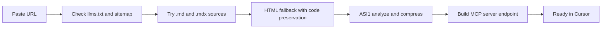

# Conversion pipeline

When you paste a docs URL, doc2mcp runs a multi-stage pipeline server-side. No work happens on your machine.

## 1. Discovery

doc2mcp probes the docs origin for `/llms.txt` and `/llms-full.txt` (Mintlify, OpenAI, LangChain, Anthropic, Stripe all expose these). If found, every URL in the manifest is queued.

## 2. Fetch

For each page, doc2mcp tries `${url}.md` and `${url}.mdx` first (most modern doc platforms serve raw markdown). HTML scraping is the fallback — and even then, code blocks (`<pre><code>`), headings, and links are preserved as markdown.

## 3. Analyze

ASI1 reads the structured docs and extracts:

- API endpoints and methods
- Auth patterns
- Workflows and use cases
- A compressed `llms.txt` index

## 4. Build

The MCP server is just a hosted HTTP endpoint at `/api/mcp/{projectId}/mcp` speaking JSON-RPC 2.0. A unique Bearer token is minted, hashed, and stored.

## 5. Ready

You get a URL + token. Paste into Cursor. Total time: ~30 seconds to a few minutes depending on docs size.

## Supported source formats

Paste any of these and doc2mcp picks the right strategy automatically:

| Format | Examples | What we do |
|--------|----------|------------|
| **Mintlify docs site** | `docs.langchain.com`, `docs.anthropic.com`, `docs.stripe.com` | Read `/llms.txt` + each page's `.md` source |
| **Docusaurus / GitBook / Nextra** | `docs.nestjs.com`, `nextjs.org/docs` | HTML crawl with code-preserving extraction |
| **OpenAPI spec (JSON)** | `…/openapi.json`, Swagger Petstore | Parse + expand **one page per endpoint** (method, params, request, responses) |
| **OpenAPI spec (YAML)** | `…/openapi.yaml`, `…/spec.yml` | Same as JSON — built-in YAML parser |
| **Postman collection** | `…/collection.json` | Treated as API spec |
| **GitHub repository** | `github.com/fetchai/uAgents` | List repo tree → fetch `README.md` + every `.md`/`.mdx` in `/docs`, `/examples`, `/guides` (up to 60 files) |
| **Raw Markdown URL** | `…/README.md`, `…/intro.mdx` | Single file, frontmatter parsed |
| **Plain HTML docs** | Any docs site | Code-block-preserving extraction + Jina Reader fallback for SPA shells |
| **JavaScript-rendered SPAs** | Mintlify, React-rendered docs | Auto-fallback to Jina Reader for full text |

## Auto-detection

doc2mcp picks the right handler based on:

1. URL extension (`.md`, `.mdx`, `.json`, `.yaml`, `.yml`)
2. Hostname (`github.com`, `raw.githubusercontent.com`)
3. Path hints (`/openapi`, `/swagger`, `/spec`)
4. Content sniffing once fetched (JSON keys like `"openapi":` or `"swagger":`)
5. Marketing-page filter — if you paste `stripe.com`, doc2mcp redirects to `docs.stripe.com` automatically
