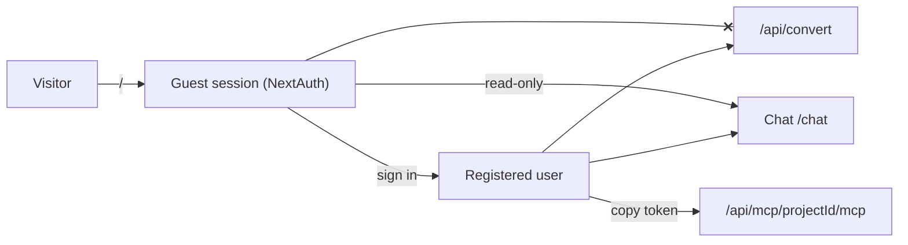
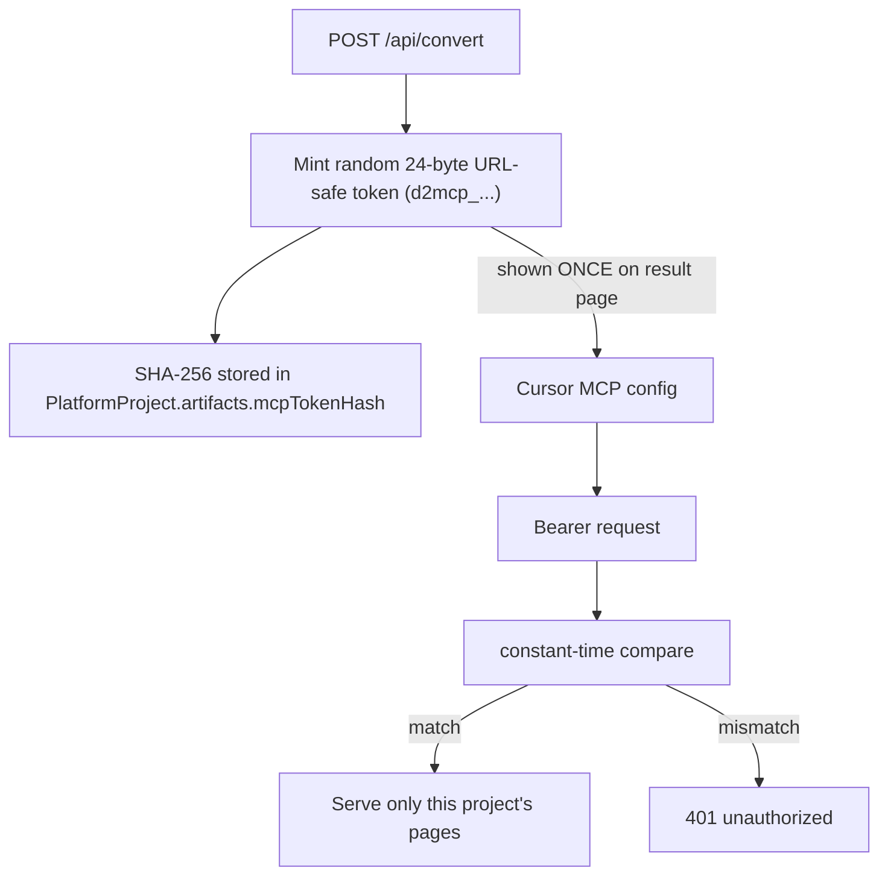
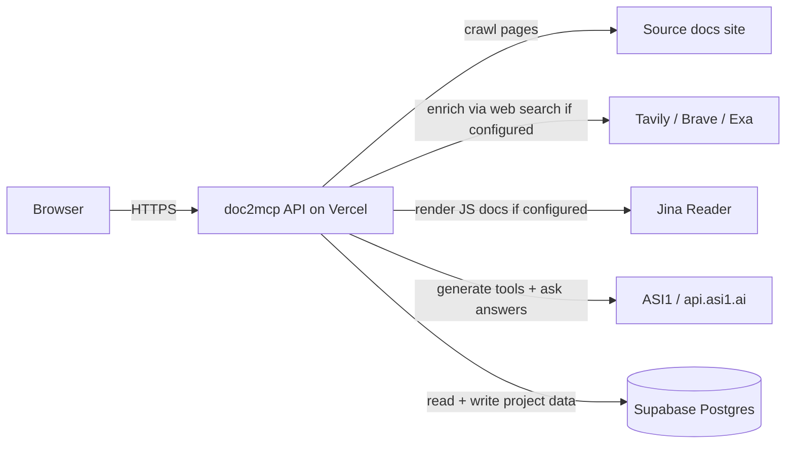

# Security

## Identity and access

| Role | Read public docs | Use chat | Generate MCP | Hit MCP endpoint |
|------|------------------|----------|--------------|------------------|
| Guest | yes | yes | no (401) | no (token required) |
| Authenticated | yes | yes | yes | yes |

Guest creation flow uses `/api/auth/guest?redirectUrl=...` to avoid client-side `signIn()` CSRF.

## MCP token isolation

Properties:

- Tokens are minted with `randomBytes(24).toString("base64url")`.
- Only the SHA-256 hash is stored — the raw token is shown once on the convert result page.
- A token is scoped to a single project; it cannot read any other project, even on the same account.
- Anyone with the URL + token can read that project's crawled docs. Treat the token like a read-only API key.
- Tokens can be rotated by deleting the project and re-running the conversion.

## What leaves your machine

| Outbound destination | When | Data sent |
|----------------------|------|-----------|
| Source docs origin | On convert + re-crawl | Plain GET requests |
| Jina Reader | When HTML is thin | The page URL only |
| Tavily / Brave / Exa | When llms.txt absent or chunks are thin | Search query + site filter |
| ASI1 | During analyze + ask_documentation | Doc excerpts and user question |
| Supabase | Always | Project metadata, artifacts, chunks |

Web search and Jina are **optional**. With no keys set, only Source docs, ASI1, and Supabase are contacted.

## Headers and proxy

- `proxy.ts` gates everything except the public-by-design routes: `/`, `/login`, `/register`, `/api/auth`, `/ping`, `/chat`, `/docs`, `/api/mcp`.
- `/api/mcp/[projectId]/mcp` accepts the Bearer token via `Authorization`, falls back to `X-Doc2MCP-Token`, then to a `?token=` query param for clients that cannot set headers.
- Guest sessions are cookie-only, signed with `AUTH_SECRET`.

## Reporting

Found a security issue? Email security@doc2mcp.dev. Please do not file a public GitHub issue.
