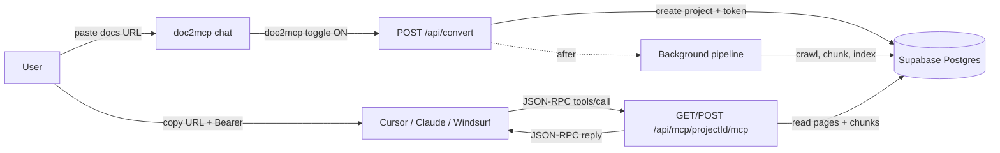
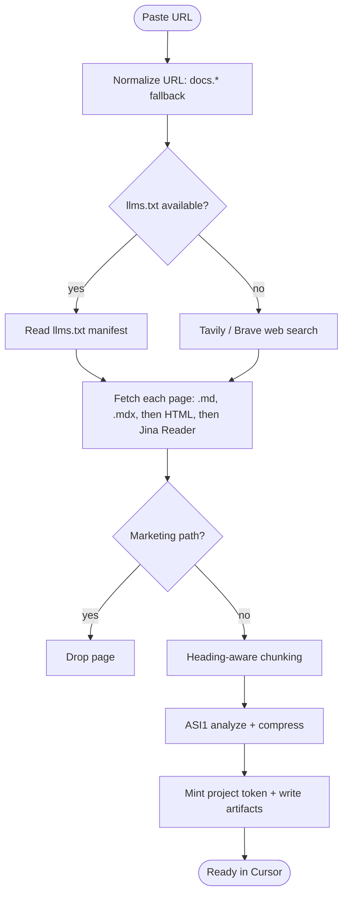
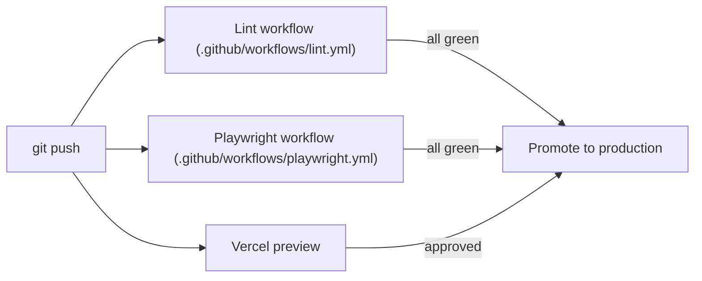
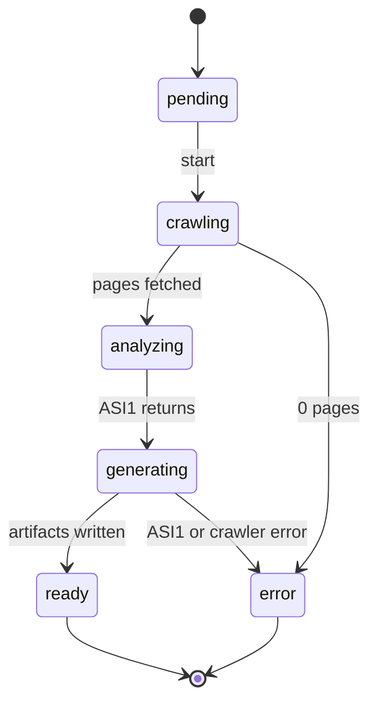

# Workflow

## High-level flow

## Pipeline stages

## CI / CD

| Job | What runs | Failures block merge? |
|-----|-----------|-----------------------|
| `lint` | `tsc --noEmit` + `pnpm check` (Biome/Ultracite) | Yes |
| `e2e` | Playwright against built app | Yes |
| Vercel preview | `next build` + deploy | Yes |

## Conversion phases (status field)

The status drives the convert page UI (`/convert/<id>`). Each transition is written to Postgres so resuming or polling just reads the row.
